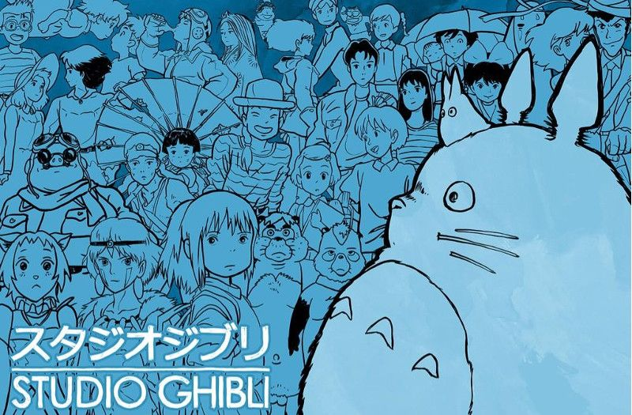

[← Volver al inicio](README.md)

# Temas del curso

Aquí van las entradas sobre lo que va pasando fuera de clase: una noticia, un artículo,
algo que ha salido y tiene que ver con lo que estamos dando.

Las propone el profesor a lo largo del curso.

## Mis aficiones - 28/09
Desde pequeña soy aficionada del baloncesto por mi padre.
Mi pasión  aumento a los 9 años, cuando me  metió a un equipo infantil
de baloncesto cerca de casa, jugué en un equipo por unos años, hasta los 14,
donde una lesión hizo que abandonará el equipo,
pero esa tragedia no hizo que mi pasion disminuyera.
[Un giphun que habla del tema](https://gist.github.com/naibu3/db7046145449860a6eb09170b53f1c68)

## 29/09 - Premios princesa 2026 - Studio Ghibli
Studio Ghibli es un estudio de animación Japonesa fundada en el año 1985, este fue nominado y 
premiado por los premios de la "Fundación Princesa de Asturias". Fue premiado 
por sus producciones que trascienden generaciones y fronteras, el amor 
por la naturaleza, la tolerancia y el respeto por los seres humanos.
Elegí a este premiado porque soy gran admiradora de este estudio y de sus producciones 
y por la alegria de que sean reconocidos internacionalmente.

[su página en la Fundación](https://www.fpa.es/es/premios-princesa-de-asturias/premiados/2026-studio-ghibli/)
